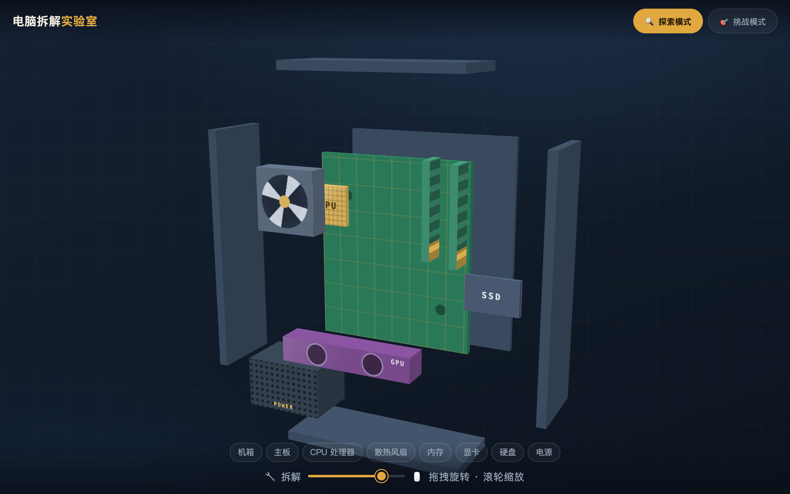
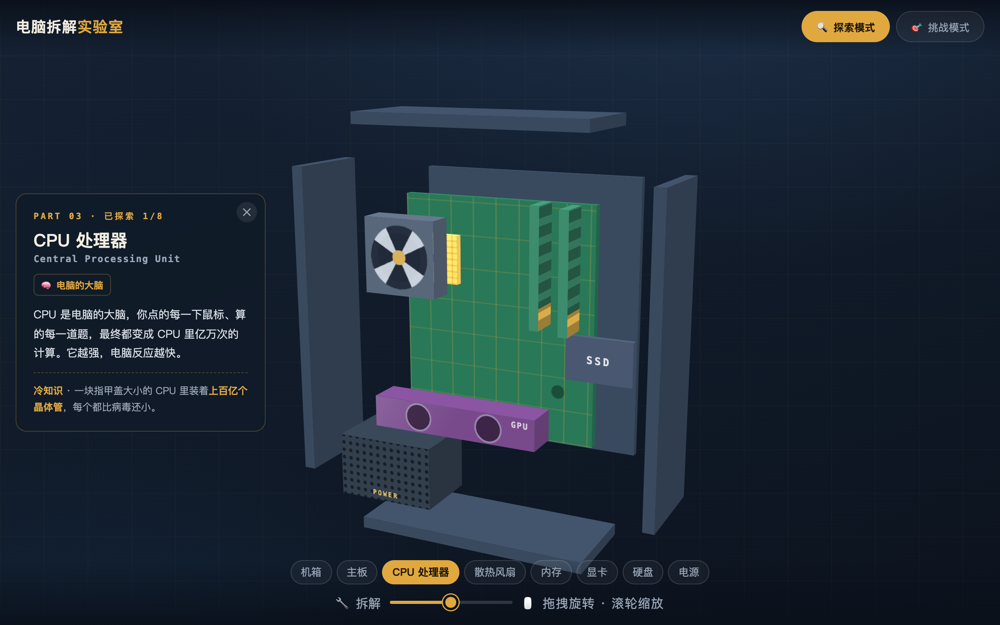
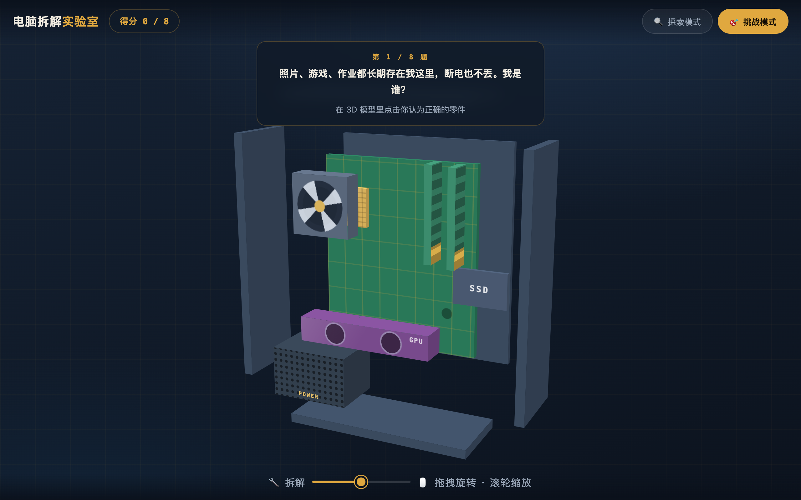

# 🖥️ 电脑拆解实验室

**一个教小朋友认识电脑的 3D 小游戏。**

电脑不是神秘的黑盒子——它是 8 个零件组成的小团队：
有大脑 🧠、有记忆 📝、有心脏 🍚，还有一位拼命画画的画家 🎨。

把它拆开看看吧！

## 怎么开始玩

不用安装任何东西：

1. 下载这个项目（点绿色的 **Code** 按钮 → **Download ZIP**，然后解压）
2. 双击 `index.html`，就能在浏览器里玩了

## 怎么玩

只有三个动作，一学就会：

| 动作 | 效果 |
|------|------|
| 🖐 按住鼠标拖动 | 转动整台电脑，滚轮可以放大缩小 |
| 🔧 拖底部的「拆解」滑块 | 零件会像变魔术一样飞散开 |
| 👆 点击任何一个零件 | 弹出小卡片，告诉你它是干什么的 |

### 🔍 探索模式：点一点，认识每个零件

每个零件都有一张小卡片：它叫什么、像什么、还有一条冷知识。
把底部 8 个名字全部点亮，你就把整台电脑认全了！

### 🎯 挑战模式：猜猜我是谁

8 道谜语题，比如——

> 「我一断电就把东西全忘光，我是谁？」

在 3D 模型里点出正确答案，答对有音效！全部答完还会给你评级：
答对 8 题就是 **🏆 装机大师**！

## 你会认识的 8 个零件

| 零件 | 它像什么 |
|------|----------|
| CPU 处理器 | 🧠 电脑的大脑 |
| 内存 | 📝 临时工作台，断电就忘光 |
| 硬盘 | 📚 长期书柜，断电也不丢 |
| 显卡 | 🎨 拼命的画家 |
| 主板 | 🛣 城市的道路 |
| 电源 | 🍚 全家的食堂 |
| 散热风扇 | ❄️ 随身小空调 |
| 机箱 | 🏠 大家的房子 |

## 给爸爸妈妈和老师

- 整个游戏就是**一个 HTML 文件**，纯 CSS 3D + 原生 JavaScript，没有任何第三方依赖，不联网、不收集任何数据
- 适合课堂投影演示，也适合孩子自己在家探索
- 支持鼠标和触屏

## 许可证

本项目采用 [CC BY-NC-ND 4.0](https://creativecommons.org/licenses/by-nc-nd/4.0/deed.zh-hans) 许可证（署名-非商业性使用-禁止演绎）：

- ✅ 可以免费玩、免费分享给别人
- ✅ 分享时请注明出处
- ❌ 不可以拿去卖钱或用于任何商业用途
- ❌ 不可以修改后当作自己的作品发布

详见 [LICENSE](LICENSE) 文件。
